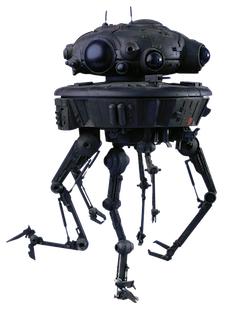
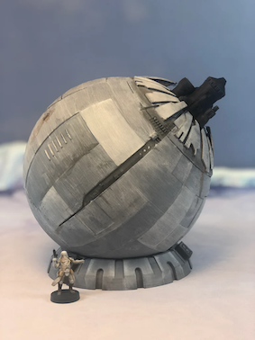

# Seedtag - Backend Engineer - Code test


# Mission

Beloved **General Lando Calrissian**,

We appreciate your work and leadership through the crucial victory in the Battle of Endor. It is vital that we keep control over the moon and its surroundings, and you have been selected for your skills in weaponry. We need your help to finish the new rebel battle station which still lacks the targeting and ion cannon management systems.

The new *Endor Battle Station* modules have a sophisticated communication system between them via **HTTP APIs**.

The mission's objective is to develop an **HTTP endpoint** that receives radar scans from our stolen probe droids as **JSON** data, determines the appropriate target to destroy, chooses and fires the best available ion cannon among the ones placed around the moon and returns a **JSON** response with the damage inflicted.

Our stolen and repurposed viper probe droids deployed around the surrounding moons and planets are constantly finding new hidden ships and targets to attack. Once available the probe droids send their radar scans to the *Endor Battle Station* along with some key information from our leaders with a **POST** request to an `/attack` endpoint.



The battle station module you will develop should process the attack request and follow the next steps:

  1. Find the next target to destroy
  2. Find the best available ion cannon
  3. Fire the chosen ion cannon to destroy the target
  4. Report back on the damage inflicted and the ion cannon used

## 1. Find next target

The probe droid radar scans are as follows:

```json
{
	"protocols": ["avoid-mech"],
	"scan":[
		{
			"coordinates": { "x": 0, "y": 40 },
			"enemies": { "type": "soldier", "number": 10 }
		}
	]
}
```

- **`protocols`:** Protocol or list of protocols to be used to determine which of the following points should be attacked first.
- **`scan`:** List of extracted points from the droid’s vision module. It's an array of points with the number of targets in that position. It has the following sub-values:
    - **`coordinates`:** Coordinates `x` and `y` of the point.
    - **`enemies`:** Enemy type `type` and number `number`. The suitable values for the type are **soldier** and **mech**.
    - (optional) **`allies`:**  Number of allies on the position. If not present, means that no allies in the zone.

To determine the next target to destroy, you must follow the rules for each of the requested protocols:

- **closest-enemies**: prioritize closest enemy point.
- **furthest-enemies** : prioritize furthest enemy point.
- **assist-allies** : prioritize enemy points with allies.
- **avoid-crossfire** : do not attack enemy points with allies.
- **prioritize-mech**: attach **mech** enemies if found. Otherwise, any other enemy type is valid.
- **avoid-mech**: do not attack any **mech** enemies.

<aside>
⚠️ It's important to mention that several protocols could be provided in the request.

</aside>

As an example, if we receive the protocols **closest-enemies** and **assist-allies**, we should choose the closest point having allies present.

The protocols that will be supplied in the call will always be compatible with each other. You can assume that the module will not receive the protocols **closest-enemies** and **furthest-enemies** in the same request.

Finally, it's important to note that targets above a distance of **100km** are considered too far to be attacked and should be ignored.

## 2. Find best available Ion Cannon

After you have found the target you must attack using one of the available ion cannons.

There are currently 3 fully operational ion cannons placed around the moon of *Endor.* Each one belongs to a different era and has a different fire time:

- **Ion Cannon 1**: 1st Generation, Fire Time 3.5s
- **Ion Cannon 2**: 2nd Generation, Fire Time 1.5s
- **Ion Cannon 3**: 3rd Generation, Fire Time 2.5s



After an ion cannon is fired, it becomes unavailable for a period of time equal to its fire time. For example, if the **Ion Cannon 1** is fired, it will be unavailable for 3.5 seconds.

The probe droids however will keep requesting new targets to be attacked at a rate of **1 request per second**, which means you'll have to use all ion cannons to keep up with the requests.

**The lowest generation ion cannons should be prioritized.** If they are all available the station should fire the 1st Generation cannon, followed by the 2nd and third.

🔧 To help you with this task, each ion cannon contains a **HTTP GET** `/status` endpoint that returns its current state. The response is a JSON object with the following structure:

```json
{
	"generation": 1,
	"available":true
}
```

*You must utilize this status to determine which ion cannon is available* to fire at the target as sometimes these cannons might overload and cause additional downtime.

Remember we want to be able to **attack the target as fast as possible upon receiving a request**.

## 3. Fire the Ion Cannon

Once the best available ion-cannon is chosen, it must be fired to destroy the target.

To fire the ion cannon, you must send a **HTTP POST** request to the `/fire` endpoint with the following **JSON** payload body:

```json
{
	"target": { "x": 0,"y": 40 },
	"enemies":1
}
```

The cannon will then return a JSON response with the damage inflicted and the generation it belongs to:

```json
{
	"casualties": 1,
	"generation": 1
}
```

## 4. Report

The response of the *Endor Battle Station* `/attack` endpoint should be a **JSON** object with the following structure:

```json
{
	"target": { "x": 0, "y": 40 },
	"casualties": 1,
	"generation":1
}
```

This will allow the probe droids to report back to the leaders managing them and keeping track of the usefulness of ion cannons in *Endor*.

---

# Additional Considerations

The attack module for the *Endor Battle Station* could be written in **any language** you prefer but it should be developed using a **docker environment** with docker-compose so that the local *Ewoks* can further test it and maintain it after you are gone.

Moreover, our intelligence forces obtain new information and strategies every day, so it's fundamental that the generated code is easy maintainable and extensible. To do that, good practices and some **testing** should be applied.

Because of the importance of the mission for the New Republic, we have provided an initial docker-compose with the simulated ion cannons along with several test cases that will at least verify that the algorithm works correctly.

These tests are timed using the same request per second rate as the probe droids. If the response time is too slow, the battle station will not be able to destroy all targets in time.

You should have `curl` installed and run the command `./tests.sh` in your machine.

# Delivery

After completing the mission, push your solution to this repository.

Good luck, **may the Force be with you.**
